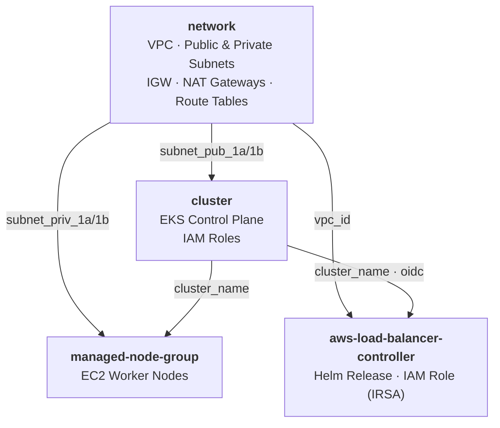

# Terraform

This project provisions a production-ready **Amazon EKS** cluster on AWS using Terraform. It is structured into reusable modules that cover the full infrastructure stack, including networking, the EKS control plane, managed node groups, and the AWS Load Balancer Controller.

## Architecture

<!-- BEGIN_TF_DOCS -->
## Requirements

| Name | Version |
| ---- | ------- |
|  [aws](#requirement\_aws) | 6.45.0 |
|  [helm](#requirement\_helm) | 3.1.1 |
|  [kubernetes](#requirement\_kubernetes) | 3.1.0 |

## Providers

No providers.

## Modules

| Name | Source | Version |
| ---- | ------ | ------- |
|  [eks\_aws\_load\_balancer\_controller](#module\_eks\_aws\_load\_balancer\_controller) | ./modules/aws-load-balancer-controller | n/a |
|  [eks\_cluster](#module\_eks\_cluster) | ./modules/cluster | n/a |
|  [eks\_managed\_node\_group](#module\_eks\_managed\_node\_group) | ./modules/managed-node-group | n/a |
|  [eks\_network](#module\_eks\_network) | ./modules/network | n/a |

## Resources

No resources.

## Inputs

| Name | Description | Type | Default | Required |
| ---- | ----------- | ---- | ------- | :------: |
|  [cidr\_block](#input\_cidr\_block) | Networking CIDR block to be used for the VPC | `string` | n/a | yes |
|  [project\_name](#input\_project\_name) | Project name to be used in tags | `string` | n/a | yes |
|  [region](#input\_region) | AWS region to create the resources | `string` | n/a | yes |
|  [tags](#input\_tags) | A map of tags to add to all AWS resources | `map` | n/a | yes |

## Outputs

No outputs.
<!-- END_TF_DOCS -->
